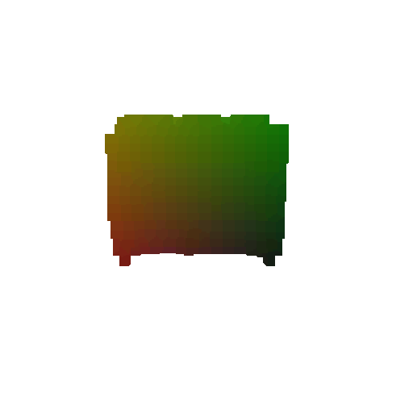

# 16-825 Assignment 2: Single View to 3D
number or late days used:

## 1. Exploring loss functions

### 1.1. Fitting a voxel grid (5 points)

Visualize the optimized voxel grid along-side the ground truth voxel grid using the tools learnt in previous section.

|Ground Truth|Optomized|
|:-:|:-:|
|||

### 1.2 Fitting a point cloud (10 points)

Visualize the optimized point cloud along-side the ground truth point cloud using the tools learnt in previous section.

|Ground Truth|Optomized|
|:-:|:-:|
|||

### 1.3 Fitting a mesh (5 points)

Visualize the optimized mesh along-side the ground truth mesh using the tools learnt in previous section.

|Ground Truth|Optomized|
|:-:|:-:|
|||

## 2. Reconstructing 3D from single view

### 2.1. Image to voxel grid (15 points)

Visuals of any three examples in the test set. For each example show the input RGB, render of the predicted 3D voxel grid and a render of the ground truth mesh.

|Input RGB|Ground Truth Mesh|Ground Truth Voxel|Predicted Voxel|
|:-:|:-:|:-:|:-:|
|||||
|||||
|||||

The Voxel Model I had implemented was based on Pixel2Mesh, with the two major difference being the use of Leaky ReLU instead of ELU and a shorter run time/different scheduler milestones (75 epochs with milestone at 50 instead of 350 epochs with milestones and refinement at [150, 250]). Also note that instead of saving the latest model, I saved the model which scored the highest average F1 value (evaluated once every epoch); this technique holds true for the subsequent models as well.

<!-- The f1 scores of visualized models are: 100.000, 77.271, and 97.291 -->

### 2.2 Image to point cloud (15 points)

Visuals of any three examples in the test set. For each example show the input RGB, render of the predicted 3D point cloud and a render of the ground truth mesh.

|Input RGB|Ground Truth Mesh|Ground Truth Cloud|Predicted Cloud|
|:-:|:-:|:-:|:-:|
|||||
|||||
|||||

The cloud model I implemented was a simple 2 FCL model which was run for 40 epochs (with last saved model at epoch 31). I had tried expanding the model to be larger, however I found that this simple model outperformed all deeper, wider, and more complex (with convolution) models. 

<!-- The f1 scores of visualized models are: 99.850, 99.710, and 98.959 -->

### 2.3 Image to mesh (15 points)

Visuals of any three examples in the test set. For each example show the input RGB, render of the predicted mesh and a render of the ground truth mesh.

|Input RGB|Ground Truth Mesh|Predicted Mesh|
|:-:|:-:|:-:|
||||
||||
||||

The mesh model I implemented was a simple FCL model which was run for *** epochs. Similarly to the point cloud model, I had tried expanding the model to be larger and, again, found that this simple model outperformed all deeper, wider, and more complex (with convolution) models.

### 2.4 Quantitative comparisions(10 points)

Average test F1 score at 0.05 threshold for voxelgrid, pointcloud and the mesh network.

| Type        	| Voxel  	| Point Cloud 	| Mesh  	|
|-------------	|:--------:	|:-------------:	|:-------:	|
| Avg F1@0.05 	| 90.890 	| 96.155      	| 91.390 	|

Something to note before discussion is that all the models I had implemented were run until loss seemed to stop decreasing, however the runtime and complexity of the Voxel model was significantly higher than the other two as mentioned in the previouse sections. Keeping this in mind, here is an intutive explaination justifying the comparision between models:

1. The point cloud model performed the best. Intuitively and in practice, point clouds are the easiest to optomize. Since points in a cloud are not bound by connectivity, they are affected by neither the inherent connectivity limitations of marching cube (such as with voxels) nor by need to define faces besed on vertex connections (such as with mesh). Because of this factor, misplacement of a single point in a pointcloud does not affect the rest of the model as much as a single voxel or vertex can affectt a voxel or mesh model, therefore allowing the model to converge faster and for the prediction model to be simpler.
2. While the mesh model technically performed the better than the voxel model, visually it is the least convincing. Intuitively, the reasonable placement of the vertices makes sense for the same reasons as the point cloud model. On the other hand, the inability for the model to predict face orientation well also makes sense due to the now sampling value being used (default of n_points=5000) when calculating loss. Since the number of faces on the ground truth and predicted models are higher than 5000, it makes sense that the model's loss values are not as informative as desired. Another disadvantage that the model faces is the constraint of the spherical topology. This factor makes it impossible for the mesh to accurately represent chairs that require more complex topologies (such as designs that place holes in the backrest of the chair or armrests that form a loop).
3. The voxel model performed slightly worse than point cloud and mesh. Although it is more complex in concept than point clouds, it benefitted from a well designed architecture that utilizes 3D convolutions which allowed it to gain more spatial reasoning about the discretized space (in this case designated to be 32x32x32). Furthermore, this model in particular benefitted from longer runtime than the other models which seems to have. Interestingly, it looks better than the mesh models but has a worse performance score. This discrepency may be due to the fact that the resolution of the voxel discretization is rather coarse, therefore the model has a hard time representing details, as seen in section 2.6; it can only represent volume by a fixed voxel size regardless of how small the occuying piece is.

### 2.5 Analyse effects of hyperparms variations (10 points)

Due to the fact that the surfaces of the mesh model seemed so disjointed, I chose to analyze the effect of w_smooth and see if I could obtain a better result. In order to do so, I trained 4 models (10 epochs each) with the following w_smooth values: 0.01, 1.0, 2.0, 3.0, 4.0, and 5.0. Throughout this process all other parameters remailed constant and w_chamfer was set to 1.0. Note that I did have a reduce on plateau scheduler in place that may have caused some discrepancies in training process. Additionally The outcomes of my models were as follows:

| w_smooth | 0.01 | 1.0 | 2.0 | 3.0 |
|-------------|:--------:|:--------:|:--------:|:--------:|
| Example 1 |  | |||
| Example 2 |  | |||
| Example 3 |  | |||
| f1@0.05 | 91.390 | 90.755 | 93.027 |90|

### 2.6 Interpret your model (15 points)

Simply seeing final predictions and numerical evaluations is not always insightful. Can you create some visualizations that help highlight what your learned model does? Be creative and think of what visualizations would help you gain insights. There is no `right' answer - although reading some papers to get inspiration might give you ideas.

As I watched my models train, I noticed that the models seemed to first learn to predict a generic "seat" shaped blob before further training allowed them more accurately represent the individual inputs. However, I suspect that the models still have a "default" behavior in scenarios where the input is unusual or difficult to interperate. To help visualize this behavior, I have included 3 edge cases in which this behavior emerges.

First, detailed designs. These are cases in which the seats have relatively intricate designs or unusual decorations which is seems to confuse the model as they have no consistent representation within the dataset, these instances usually result in a very generic chair shaped output that ignore the details.

| label | example 1 | example 2 | example 3 | example 4 |
|-------------|:--------:|:--------:|:--------:|:--------:|
| target |  |  |  |  |
| prediction |  |  |  |  |

Second, unique legs. These are cases in which the seats have uncommon leg designs. While the model is very good at predicting, and defaults to having, either a generic four legged chairs or some sort of single support seat, it struggles to identify orther characteristics like rollers, thin leg, or unique shaped supports. Note that this effect is especially prominent with thin legs and could be at least partially attributed to the fact that, because they take up so little space, they are unlikely to be well sampled in the training process and thus difficult for the model to learn.

| label | example 1 | example 2 | example 3 | example 4 |
|-------------|:--------:|:--------:|:--------:|:--------:|
| target |  |  |  |  |
| prediction |  |  |  |  |

Third, oddly shapped seats. These are cases in which the seats does not follow the general form factor of the rest of the examples. In these cases, the "defaulting" behavior is especially prominent. Whenever, the model encounters these unusual seats it seems to default to a few generic features of chairs such as arm rests, flat (and mostly square) backs, and some sort of perpendicular support. Thus, the resulting prediction looks somewhat like a chair, just not the chair being targetted.

| label | example 1 | example 2 | example 3 | example 4 |
|-------------|:--------:|:--------:|:--------:|:--------:|
| target |  |  |  |  |
| prediction |  |  |  |  |

## 3. (Extra Credit) Exploring some recent architectures.
