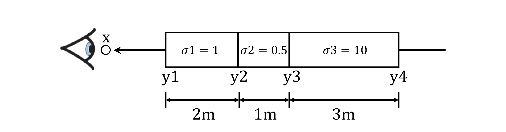
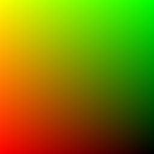
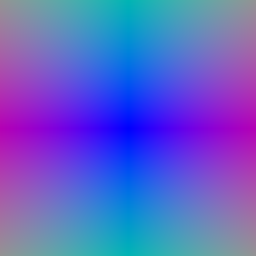
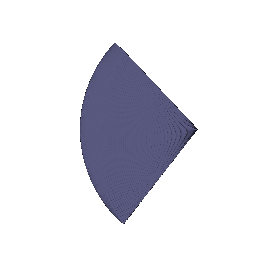
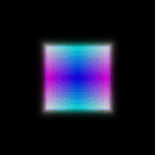
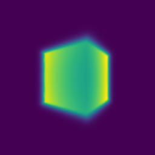
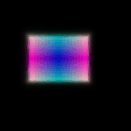
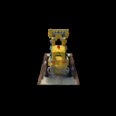

# Assignment 3: Volume Rendering and Neural Radiance Fields
number or late days used:

# A. Theory 
## Transmittance Calculation (10 points)

# B. Implementation

##  1.3. Ray sampling (10 points)

The outputs of grid/ray visualization:

    

##  1.4. Point sampling (10 points)

Visualize the point samples from the first camera.

##  1.5. Volume rendering (30 points)
Spiral rendering and visualization of the depth in your write-up.

 

##  2. Optimizing a basic implicit volume

##  2.1. Random ray sampling (5 points)

Implemented in `get_random_pixels_from_image` method in `ray_utils.py` 

##  2.2. Loss and training (5 points)

Center of the box, and the side lengths of the box after training, rounded to the nearest `1/100` decimal place:
- Box center: (0.25, 0.25, 0.00)
- Box side lengths: (2.00, 1.50, 1.50)

##  2.3. Visualization

The code renders a spiral sequence of the optimized volume in `images/part_2.gif`. Compare this gif to the one below, and attach it in your write-up:

##  3. Optimizing a Neural Radiance Field (NeRF) (30 points)

Spiral rendering of bulldozer results

##  4. NeRF Extras (***Choose at least one!*** More than one is extra credit)

###  4.1 View Dependence (10 pts)

I had completed this step while implementing part 3 since I was closely following the NeRF paper according to its supplementary material (Appendix A) which included view dependence. 

The trade-offs between increased view dependence and generalization quality.

###  4.2 Hierarchical Sampling (10 pts)

NeRF employs two networks: a coarse network and a fine network. During the coarse pass, it uses the coarse network to get an estimate of geometry geometry, and during fine pass uses these geometry estimates for better point sampling for the fine network. Implement this hierarchical point-sampling strategy and discuss trade-offs (speed / quality).

###  4.3 High Resolution Imagery (10 pts)

Run NeRF on high-res imagery using the `nerf_lego_highres.yaml` config file. This will take a long time to train -- play around with some hyper parameters (point samples per ray, network capacity) and report your results