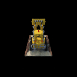

# Assignment 3: Volume Rendering and Neural Radiance Fields
number or late days used:

##  1.3. Ray sampling (10 points)

The outputs of grid/ray visualization:

    

##  1.4. Point sampling (10 points)

Visualization of the point samples from the first camera:

##  1.5. Volume rendering (30 points)

Part 1 visualization and depth visualization:

 

##  2. Optimizing a basic implicit volume

##  2.1. Random ray sampling (5 points)

Implemented in `get_random_pixels_from_image` method in `ray_utils.py`.

##  2.2. Loss and training (5 points)

After optimizing the position and side lengths of a box, I found the center of the box and the side lengths of the box (rounded to the nearest `1/100` decimal place) to be the following:

- Box center: (0.25, 0.25, 0.00)
- Box side lengths: (2.00, 1.50, 1.50)

##  2.3. Visualization

After implementing loss, I rendered a spiral sequence of the optimized volume in `images/part_2.gif` and compare the result to the GIF provided in the writeup:

|Provided GIF|My Output|
|:-:|:-:|
|||

##  3. Optimizing a Neural Radiance Field (NeRF) (30 points)

After implementing the NeRF model as described in the paper (without heirarchical sampling), I rendered a spiral sequence of the lego bulldozer and compared the result to the GIF provided in the writeup:

|Provided GIF|My Output|
|:-:|:-:|
|||

##  4. NeRF Extras (***Choose at least one!*** More than one is extra credit)

###  4.1 View Dependence (10 pts)

I had completed this section while implementing part 3 since I was closely following the NeRF paper according to its supplementary material (Appendix A) which included view dependence, positional encoding, and a skip connection. 

As suggested by the name, view dependence can allow the model to better represent qualities of the model that depend on the direction it is being view in, the most notable trait being specular reflection on materials. By integrating view dependence, the model can represent how the same point in the model can change in color depending on the viewing direction. On the otherhand, with a skewed or small sample size during training, the model could also overfit to a certain training sample and cause the final model to take on properties that are not generalizable, e.g. training the model on images where white light is reflecting off a metallic surface may cause the model to render the surface as white even though the object is a different color when not reflecting light.

###  4.3 High Resolution Imagery (10 pts)

I ran the NeRF on high-res imagery using the `nerf_lego_highres.yaml` config file. Without changing any other parameters, I varied the point samples per ray and obtained the following results

|Points Per Ray|Output|
|:-:|:-:|
|32||
|64||
|96||
|128||

As seen, as the number of samples per ray increase the resolution of the final output also increases, even with extended training time. This result intuitively makes sense as the number of samples decrease, the samples become more spread apart and are less capable of representing details accurately.
