# Assignment 4: Neural Surfaces
Number of late days used:


##  1. Sphere Tracing (30pts)

`part_1.gif` generated by my code:

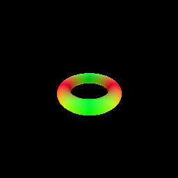

The pseudocode for my sphere tracing process is provided below:


In order to implement sphere tracing, I first initialized the points to be the provided origins (1). Then the algorithm iterates by max_iters which is provided by the configuration file used (2). During ever iteration, the distance between the points to the closest surface is obtained using the implicit_fn (3) and the points position are moved along their associated directions by the calculated distances using einsum (4). Finally, the distance of each resulting point to the closest surface is used to create a mask where any point with a distance less than self.epsilon is set to true (6,7). Note, that the self.epsilon is set during SphereTracingRenderer initialization and is default set as 1. Finally, the final points and associated mask is returned (8).

##  2. Optimizing a Neural SDF (30pts)

Visualizes of the input point cloud used for training and the NeuralSurface prediction. 

|Input Point Cloud|Model Output|
|:-:|:-:|
|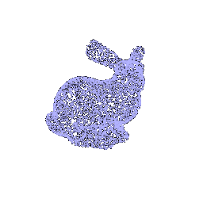|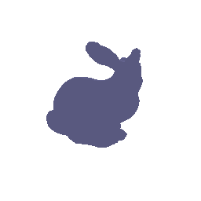|

Brief descriptions of your MLP and eikonal loss:

The MLP I used was based on the NeRF model and had the following architecture


The input vectors are shown in green, intermediate hidden layers are shown in blue, output vectors are shown in orange, and the number inside each block signifies the vector’s dimension. All layers are standard fully-connected layers, black arrows indicate layers with ReLU activations, orange arrows indicate layers with sigmoid activation, and “+” denotes vector concatenation. The positional encoding of the input location (γ(x)) is passed through 6 fully-connected ReLU layers, each with 128 channels. I also took inspiration from the DeepSDF architecture and include a skip connection that concatenates this input to the to the activation of the middle layer. Note that the number of harmonics in the embedding, layer dimensions, and number of layers can all be modified by the config file.

For my eikonal loss, I used the absolute value of the difference between the L2 norm of the gradient and 1 (which is the taget value for the norm). For a batch input, the equation is defined as loss = mean(abs(norm(gradients-1)))

##  3. VolSDF (20 pts)

* **Color Prediction**: Extend the the `NeuralSurface` class to predict per-point color. You may need to define a new MLP (a just a few new layers depending on how you implemented Q2). You should then implement the `get_color` and `get_distance_color` functions.

Using section 3.1 of the [VolSDF Paper](https://arxiv.org/pdf/2106.12052.pdf), we implement their for formula converting signed distance to density which is 

<p align="center">
  
</p>
<p align="center">
  
</p>

In this equation, α and β are defined as learnable parameters, however in our implementation we will be setting these values. β defines the standard deviation of the 0 mean Cumulative Distribution Function (CDF, denotes as Ψ_β) which is used to describe a homogeneous object along with with a constant density scaling factor α. Looking at the equation, we can intuitively think of higher α as higher overall density and higher β as greater smoothness in the output. Given this understanding we can draw the following conclusions:

1. How does high `beta` bias your learned SDF? What about low `beta`?

A higher β causes the the SDF surface to be extremely smooth while a lower β to have sharp boundaries.

2. Would an SDF be easier to train with volume rendering and low `beta` or high `beta`? Why?

A SDF may be more easily trained with a higher value of β since the predicte surface distribution is spread out across a larger area, giving the for the output a higher chance of being close to or overlap with the ground truth and therefore allowing the model to more smoothly convergence while. The wide distribution also ensures that the model will be less likely to overfit to any given sample. On the other hand, a lower value of β could cause the gradients of the model to be unstable during training as the gradients could be extremely large and distincly different for each sample causing the training loss to blow up.

3. Would you be more likely to learn an accurate surface with high `beta` or low `beta`? Why?

A SDF may be more accurate with a lower value of β since the predicte surface distribution is tight and thus able to better represent sharp edges and fine details.  While a higher value of β may converge more smoothly, as mentioned in the previouse point, the larger distribution means that even if the distribution is centered around the ground truth, the higher standard deviation in the model will cause it tp be less accurate.

My best results were acheived with the default configurations and are as follows: 

 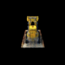


I had run my model with the default configurations. For reference, the MLP I had the following architecture:


(Details on how to interprest the visual can be found in section 2.)

Then, I experimented some of my parameters, An example of how I tuned my parameters is visualized below where I am varying the parameters of β:

|β Values|Geometry|Full Visualization|
|:-:|:-:|:-:|
|0.05|||
|0.1|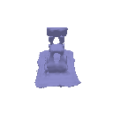|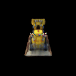|
|0.25|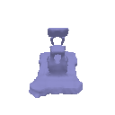|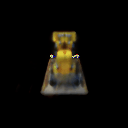|
|0.5|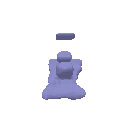||

As seen, the larger the β value, the blurrier the final imaage. Additionally, with a larger β, some random color artifacts also appeared. Also to note, with my architecture, β of less than 0.05 would begin training reasonably but the loss would randomly explode causing the model to start diverging, even with gradient clipping in place. I theorized that a lower β may require a lower and/or faster decaying lr.

## 4. Phong Relighting (20 pts)


```bash
python -m a4.main --config-name=phong
```

This will save `part_4_geometry.gif` and `part_4.gif` in the `images` folder, showing your model under rotating lights.


Visualizes of the bulldozer under rotating lights  point cloud used for training and the NeuralSurface prediction. 

|Relight Geometry|Relight Visualization|
|:-:|:-:|
|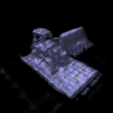|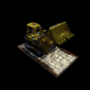|

## 5. Neural Surface Extras (CHOOSE ONE! More than one is extra credit)

### 5.1. Render a Large Scene with Sphere Tracing (10 pts)
In this section, I define a custom ‘scene’ with 31 primitive circles to create...

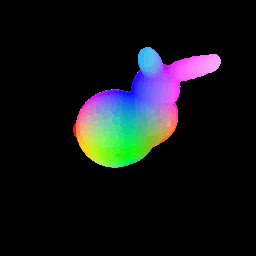

A primitive bunny!
### 5.2 Fewer Training Views (10 pts)
 Here is a comparison of the VolSDF solution to a NeRF solution learned different 20 views:

| Views |VolSDF solution|NeRF solution|
|:-:|:-:|:-:|
|10|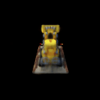||


### 5.3 Alternate SDF to Density Conversions (10 pts)
For this section, I implemented the ‘naive’ solution from the [NeuS paper](https://arxiv.org/pdf/2106.10689.pdf) which can be described as 

<p align="center">
  
</p>

where s is a used set parameter. Below I have included various outputs and their associated s values:

|s Values|Geometry|Full Visualization|
|:-:|:-:|:-:|
|10|||
|20|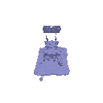|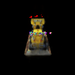|
|30|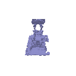||
|40|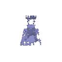|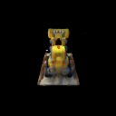|
