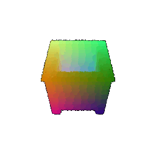

# Assignment 4: Neural Surfaces
Number of late days used:

## Q1. Classification Model (40 points)

After training my model for 250 epochs, the best model was saved at epoch 170 and the test accuracy of my best model was 0.9790

Visualization of successful predictions:

|**Class**|Chairs|Vases|Lamps|
|:-:|:-:|:-:|:-:|
|**Point Cloud**||||

Visualization of unsuccessful predictions and their predicted classes:

|**Class**|Chairs|Vases|Lamps|
|:-:|:-:|:-:|:-:|
|**Prediction**|Lamps|Lamps|Vases|
|**Point Cloud**||||

interpretation in a few sentences.  

## Q2. Segmentation Model (40 points) 

After training my model for 250 epochs, the best model was saved at epoch 160 and the test accuracy of my best model was 0.9872.

Visualization of good predictions:

|**Accuracy**|0.9373|0.9854|0.9044|
|:-:|:-:|:-:|:-:|
|**Predicted**||||
|**Ground Truth**||||

Visualization of bad predictions:

|**Accuracy**|0.5212|0.6654|0.5931|
|:-:|:-:|:-:|:-:|
|**Predicted**||||
|**Ground Truth**||||

and provide interpretation in a few sentences.
  
## Q3. Robustness Analysis (20 points) 

### Experiment 1: Rotation Invariance

For this experiment, I will rotate the input point clouds about the x axiz by certain radian and report how much the accuracy falls. 

First, I look at how rotation affects classification accuracy. I have also re-visualize the successful examples from Q1 and indicate whether these specific examples succeed once rotated.

|**Rotation**|**Accuracy**|Chairs|Vases|Lamps|
|:-:|:-:|:-:|:-:|:-:|
|0.2 rad|0.9496|successful |successful |successful |
|0.4 rad|0.8195|successful |successful |successful |
|0.6 rad|0.5813|successful |successful |successful |
|0.8 rad|0.3809|successful |failed, predicted lamp |successful |
|1 rad|0.2330|successful |failed, predicted chair |failed, predicted chair |
|1.2 rad|0.2130|failed, predicted vase |failed, predicted chair |failed, predicted chair |

As seen ***

Next, I look at how rotation affects segmentation accuracy. I have also re-visualize "good" examples from Q2 and indicated their assiciated accuracy once rotated.

|**Rotation**|**Accuracy**|Chairs|Vases|Lamps|
|:-:|:-:|:-:|:-:|:-:|
|0 rad| Ground truth||||
|0.2 rad|0.8276|Sample accuracy: 0.9121 |Sample accuracy: 0.9768 |Sample accuracy: 0.8276 |
|0.4 rad|0.7519|Sample accuracy: 0.9017 |Sample accuracy: 0.9144 |Sample accuracy: 0.7519 |
|0.6 rad|0.6397|Sample accuracy: 0.8682 |Sample accuracy: 0.8491 |Sample accuracy: 0.6397 |
|0.8 rad|0.5982|Sample accuracy: 0.819 |Sample accuracy: 0.8239 |Sample accuracy: 0.5982 |
|1 rad|0.488|Sample accuracy: 0.6968 |Sample accuracy: 0.7617 |Sample accuracy: 0.488 |
|1.2 rad|0.3231|Sample accuracy: 0.5949 |Sample accuracy: 0.734 |Sample accuracy: 0.3231 |

Accuracy and visualization on a few samples in comparison with my results from Q1 & Q2.

Provide some interpretation in a few sentences.

### Experiment 2: Number of Points 

For this experiment, I will input a different number of points points per object.

First, I look at how number of points affects classification accuracy. I have also re-visualize the successful examples from Q1 and indicate whether these specific examples succeed once number of points is changes.

|**Number of Points**|**Accuracy**|Chairs|Vases|Lamps|
|:-:|:-:|:-:|:-:|:-:|
|1000 points|0.9790|successful |successful |successful |
|500 points|0.9675|successful |successful |successful |
|100 points|0.9087|successful |successful |successful |
|50 points|0.7555|successful |successful |successful |
|10 points|0.2550|failure, predicted lamp |failure, predicted lamp |successful |
|1 points|0.2455|failure, predicted lamp |failure, predicted lamp |successful |

Next, I look at how number of points affects affects segmentation accuracy. I have also re-visualize "good" examples from Q2 and indicated their assiciated accuracy once number of points is changes.

|**Number of Points**|**Accuracy**|Chairs|Vases|Lamps|
|:-:|:-:|:-:|:-:|:-:|
|1000 points| Ground truth||||
|500 points|0.87|Sample accuracy: 0.952 |Sample accuracy: 0.998 |Sample accuracy: 0.87 |
|100 points|0.85|Sample accuracy: 0.92 |Sample accuracy: 0.99 |Sample accuracy: 0.85 |
|50 points|0.78|Sample accuracy: 0.94 |Sample accuracy: 0.98 |Sample accuracy: 0.78 |
|10 points|0.2|Sample accuracy: 0.5 |Sample accuracy: 1.0 |Sample accuracy: 0.2 |

Provide some interpretation in a few sentences.

Q1: 
S indices:  [0, 617, 719]
F indices:  [406, 618, 750]
Q2: 
S indices:  [0, 1, 2]
F indices:  [26, 41, 61]

## Q4. Expressive architectures (10 points + 20 bonus points)

In this section I improve the base model performance by implementing transformation blocks and utilizing skip connections in a similar way [Point Transformers](https://arxiv.org/abs/2012.09164). 

After training my classification model for 250 epochs, the best model was saved at epoch 154 with an accuracy of 0.9811 which is a slight improvement over my original model (0.9790).

When looking at my examples from Q1, the successful predictions remained the same:

|**Class**|Chairs|Vases|Lamps|
|:-:|:-:|:-:|:-:|
|**Prediction**|Chairs|Vases|Lamps|
|**Point Cloud**||||

And the new model was able to successfully predict one example (leftmost) that it was previously unable to predict correctly:
|**Class**|Chairs|Vases|Lamps|
|:-:|:-:|:-:|:-:|
|**Prediction**|Chairs|Lamps|Vases|
|**Point Cloud**||||

