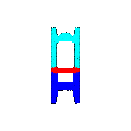

# Assignment 4: Neural Surfaces
Number of late days used:

## Q1. Classification Model (40 points)

After training my model for 250 epochs, the best model was saved at epoch 170 and the test accuracy of my best model was **0.9790**

Visualization of successful predictions:

|**Class**|Chairs|Vases|Lamps|
|:-:|:-:|:-:|:-:|
|**Point Cloud**||||

Visualization of unsuccessful predictions and their predicted classes:

|**Class**|Chairs|Vases|Lamps|
|:-:|:-:|:-:|:-:|
|**Prediction**|Lamps|Lamps|Vases|
|**Point Cloud**||||

While the model is mostly successful at predicting these object's classes, it seems that it fails when these object have unexpected or ambiguous shapes. For example, in the chair failure case, the chair seems to be folded up which may be somthing that is rare in the dataset. In the vase failure case, the vase is a simple shape which could also potentially look like a round ottoman (chair) or a cylinder lamp. In the lamp failure case, the lamp has a abtract geometric shape which may be unexpected by the model and therefor difficult to classify accurately, or altermativly most abstract geometric objects in the dataset are vases which biases the model to label all geometric objects as vase.

## Q2. Segmentation Model (40 points) 

After training my model for 250 epochs, the best model was saved at epoch 160 and the test accuracy of my best model was 0.9001.

Visualization of good predictions where the lower bound for accuracy to be considered success is 0.9:

|**Accuracy**|0.9373|0.9854|0.9044|
|:-:|:-:|:-:|:-:|
|**Predicted**||||
|**Ground Truth**||||

Visualization of bad predictions where the upper bound for accuracy to be considered failure is 0.7:

|**Accuracy**|0.5212|0.6654|0.5931|
|:-:|:-:|:-:|:-:|
|**Predicted**||||
|**Ground Truth**||||

While the model is mostly successful at predicting at least part of each section, the boundaries between section seem difficult for the model to prdict exactly. This issue is less prominent for chairs where each section (seat, back, arms, legs, etc.) are very distict from one another, as shown by the successful predictions, however for less clear-cut shapes like the couches in the failure case, the model has difficulty segmenting each component as the distinction is arguably somewhat arbitrary.
  
## Q3. Robustness Analysis (20 points) 

### Experiment 1: Rotation Invariance

For this experiment, I will rotate the input point clouds about the x axiz by certain radian and report how much the accuracy falls. 

First, I look at how rotation affects classification accuracy. I have also re-visualize the successful examples from Q1 and indicate whether these specific examples succeed once rotated.

|**Rotation**|**Accuracy**|Chairs|Vases|Lamps|
|:-:|:-:|:-:|:-:|:-:|
|0.2 rad|0.9496|successful |successful |successful |
|0.4 rad|0.8195|successful |successful |successful |
|0.6 rad|0.5813|successful |successful |successful |
|0.8 rad|0.3809|successful |failed, predicted lamp |successful |
|1 rad|0.2330|successful |failed, predicted chair |failed, predicted chair |
|1.2 rad|0.2130|failed, predicted vase |failed, predicted chair |failed, predicted chair |

As seen, the model seems somewhat tolerant to small rotations (less than 0.4 rad), any larger disturbances quickly causes the model to be unable to accurately predict these classes. This outcome is expected as the training data only included onjects in the upright position, thus the model would be very sensitive to orientation and would not know how to handle rotations. Note that past about 1 rad (until the angle becomes big enough to re-orient the object into the upright position), the model accuracy remains around 0.2 and a majority of the predictions result in chair which is interesting as it may indicate that the model defaults to predicting a single class the model is extremely uncertain.

Next, I look at how rotation affects segmentation accuracy. I have also re-visualize "good" examples from Q2 and indicated their assiciated accuracy once rotated.

|**Rotation**|**Accuracy**|Chairs 1|Chairs 2|Chairs 3|
|:-:|:-:|:-:|:-:|:-:|
|0 rad| Ground truth||||
|0.2 rad|0.8276|Sample accuracy: 0.9121 |Sample accuracy: 0.9768 |Sample accuracy: 0.8276 |
|0.4 rad|0.7519|Sample accuracy: 0.9017 |Sample accuracy: 0.9144 |Sample accuracy: 0.7519 |
|0.6 rad|0.6397|Sample accuracy: 0.8682 |Sample accuracy: 0.8491 |Sample accuracy: 0.6397 |
|0.8 rad|0.5982|Sample accuracy: 0.819 |Sample accuracy: 0.8239 |Sample accuracy: 0.5982 |
|1 rad|0.488|Sample accuracy: 0.6968 |Sample accuracy: 0.7617 |Sample accuracy: 0.488 |
|1.2 rad|0.3231|Sample accuracy: 0.5949 |Sample accuracy: 0.734 |Sample accuracy: 0.3231 |

Accuracy and visualization on a few samples in comparison with my results from Q1 & Q2.

As seen, the model seems to highly rely on vertical location as an indicator for segmentation class, thus making the model vulnerable to rotation. For example, as seen in the examples, the model consistently predicts the lowest points as "legs" and the section immediately above as "seat" regardless of how tilted the object is.

### Experiment 2: Number of Points 

For this experiment, I will input a different number of points points per object.

First, I look at how number of points affects classification accuracy. I have also re-visualize the successful examples from Q1 and indicate whether these specific examples succeed once number of points is changes.

|**Number of Points**|**Accuracy**|Chairs|Vases|Lamps|
|:-:|:-:|:-:|:-:|:-:|
|1000 points|0.9790|successful |successful |successful |
|500 points|0.9675|successful |successful |successful |
|100 points|0.9087|successful |successful |successful |
|50 points|0.7555|successful |successful |successful |
|10 points|0.2550|failure, predicted lamp |failure, predicted lamp |successful |
|1 points|0.2455|failure, predicted lamp |failure, predicted lamp |successful |

As seen, the model seems to tolerant decrease in sample number faily well until it reached about 50 points after which the model accuracy decreases to about 0.2, similarly to the outcome of the rotation experiment. This outcome seems to suggest that the model cam predict surprisingly well on lower number of sample points (about 100). Furthermore, the trends from this and the past experiment combined suggests that the default accuracy of the model under extremely unexpected data augmentation is consistently 0.2 and fact that lamp becomes the dominating prediction furthers my previouse theory the model defaults to predicting a single class when the model is extremely uncertain.

Next, I look at how number of points affects affects segmentation accuracy. I have also re-visualize "good" examples from Q2 and indicated their assiciated accuracy once number of points is changes.

|**Number of Points**|**Accuracy**|Chairs 1|Chairs 2|Chairs 3|
|:-:|:-:|:-:|:-:|:-:|
|1000 points| Ground truth||||
|500 points|0.87|Sample accuracy: 0.952 |Sample accuracy: 0.998 |Sample accuracy: 0.87 |
|100 points|0.85|Sample accuracy: 0.92 |Sample accuracy: 0.99 |Sample accuracy: 0.85 |
|50 points|0.78|Sample accuracy: 0.94 |Sample accuracy: 0.98 |Sample accuracy: 0.78 |
|10 points|0.2|Sample accuracy: 0.5 |Sample accuracy: 1.0 |Sample accuracy: 0.2 |

Similar to the classification model, the segmentation model seems to tolerant decrease in sample number faily well until it reached about 50 points after which the model accuracy decreases drastically. These results intuitively makes sense as the model will likely need to sample a minimal number of points to make any informed decisions, which in this case seems to be about 50-100 points.

## Q4. Expressive architectures (10 points + 20 bonus points)

In this section I improve the base model performance by implementing transformation blocks and utilizing skip connections in a similar way [Point Transformers](https://arxiv.org/abs/2012.09164). 

After training my classification model for 250 epochs, the best model was saved at epoch 154 with an accuracy of 0.9811 which is an improvement over my original model (0.9790).

When looking at my examples from Q1, the successful predictions remained the same:

|**Class**|Chairs|Vases|Lamps|
|:-:|:-:|:-:|:-:|
|**Prediction**|Chairs|Vases|Lamps|
|**Point Cloud**||||

And the new model was able to successfully predict one example (leftmost) that it was previously unable to predict correctly:
|**Class**|Chairs|Vases|Lamps|
|:-:|:-:|:-:|:-:|
|**Prediction**|Chairs|Lamps|Vases|
|**Point Cloud**||||

Similarly, I trained my segmentation model for 250 epochs, the best model was saved at epoch 213 with an accuracy of 0.9091 which is an improvement over my original model (0.9001).

Visualization of the good predictions with the new model compared to the original results show that most of the predictions improved (with exception to the rightmost example):

|**New Accuracy**|0.9546|0.9884|0.8698|
|:-:|:-:|:-:|:-:|
|**Original Accuracy**|0.9373|0.9854|0.9044|
|**New Predicted**||||
|**Original Predicted**||||

Visualization of bad predictions with the new model compared to the original results also show that most of the predictions improved (with exception to the rightmost example):

|**New Accuracy**|0.5627|0.9041|0.4964|
|:-:|:-:|:-:|:-:|
|**Original Accuracy**|0.5212|0.6654|0.5931|
|**New Predicted**||||
|**Original Predicted**||||

Interestingly, in both the good and bad predictions, we see that there are some examples that the model improved on and some that the model did worse on. The important thing seems to be that the model's improved predictions outweigh the decrease in performance in other predictions.