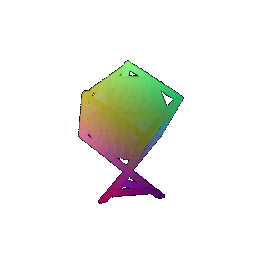
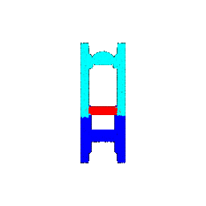
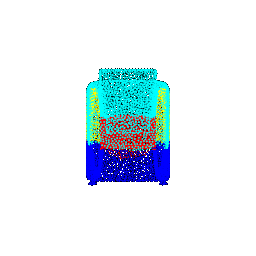

# Assignment 4: Neural Surfaces
Number of late days used:

## Q1. Classification Model (40 points)

After training my model for 110 epochs, the best model was saved at epoch 150   and the test accuracy of my best model was 0.9790

Visualization of successful predictions:

|**Class**|Chairs|Vases|Lamps|
|:-:|:-:|:-:|:-:|
|**Point Cloud**||||

Visualization of unsuccessful predictions and their predicted classes:

|**Class**|Chairs|Vases|Lamps|
|:-:|:-:|:-:|:-:|
|**Prediction**|Lamps|Lamps|Vases|
|**Point Cloud**||||

interpretation in a few sentences.  

## Q2. Segmentation Model (40 points) 

After training my model for 250 epochs, the best model was saved at epoch 160 and the test accuracy of my best model was 0.9872.

Visualization of good predictions:

|**Accuracy**|0.9373|0.9854|0.9044|
|:-:|:-:|:-:|:-:|
|**Predicted**||||
|**Ground Truth**||||

Visualization of bad predictions:

|**Accuracy**|0.5212|0.6654|0.5931|
|:-:|:-:|:-:|:-:|
|**Predicted**||||
|**Ground Truth**||||

and provide interpretation in a few sentences.
  
## Q3. Robustness Analysis (20 points) 

### Experiment 1: Rotation Invariance

For this experiment, I will rotate the input point clouds about the x axiz by certain radian and report how much the accuracy falls. 

First, I look at how rotation affects classification accuracy. I have also re-visualize the successful examples from Q1 and indicate whether these specific examples succeed once rotated.

|**Rotation**|**Accuracy**|Chairs|Vases|Lamps|
|:-:|:-:|:-:|:-:|:-:|
|0.2 rad|0.9496|successful |successful |successful |
|0.4 rad|0.8195|successful |successful |successful |
|0.6 rad|0.5813|successful |successful |successful |
|0.8 rad|0.3809|successful |failed, predicted lamp |successful |
|1 rad|0.2330|successful |failed, predicted chair |failed, predicted chair |
|1.2 rad|0.2130|failed, predicted vase |failed, predicted chair |failed, predicted chair |

As seen ***

Next, I look at how rotation affects segmentation accuracy. I have also re-visualize "good" examples from Q2 and indicated their assiciated accuracy once rotated.

Accuracy and visualization on a few samples in comparison with my results from Q1 & Q2.

Provide some interpretation in a few sentences.

### Experiment 2: Number of Points 

For this experiment, I will input a different number of points points per object (modify `--num_points` when evaluating models in `eval_cls.py` and `eval_seg.py`)

Accuracy and visualization on a few samples in comparison with my results from Q1 & Q2.

Provide some interpretation in a few sentences.

Q1: 
S indices:  [0, 617, 719]
F indices:  [406, 618, 750]
Q2: 
S indices:  [0, 1, 2]
F indices:  [26, 41, 61]

## Q4. Expressive architectures (10 points + 20 bonus points)
Instead of using a vanilla PointNet, improve the base model using one of [PointNet++](https://arxiv.org/abs/1706.02413), or [DGCNN](https://arxiv.org/abs/1801.07829), or [Point Transformers](https://arxiv.org/abs/2012.09164). Your implementation need not leverage all details of these models (e.g. you can use different levels of hierarchy), but should borrow the key design principles and should allow some improvement over the base PointNet model.

Deliverables: On your website, 

- Describe the model you have implemented.
- For each task, report the test accuracy of your best model, in comparison with your results from Q1 & Q2.
- Visualize results in comparison to ones obtained in the earlier parts.

Note that you need to implement **at least one** of the above locality methods. That will be of worth 10 points. Each extra implemented method will be of worth 10 bonus points each. 
